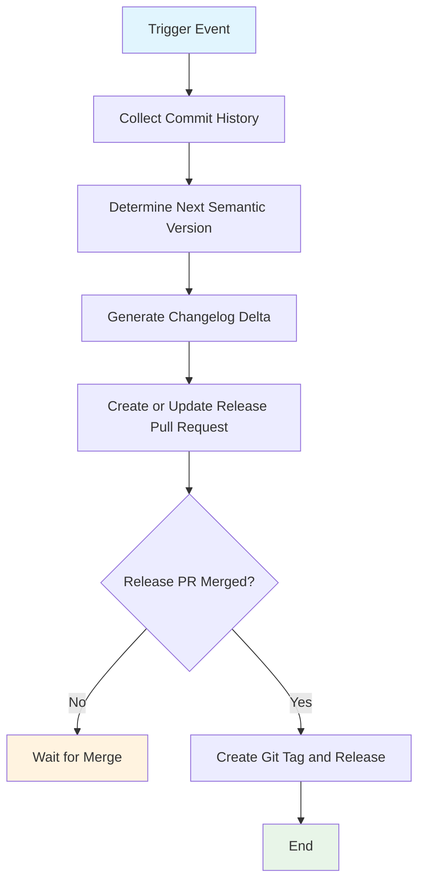

## Workflow Overview

**Purpose**: Automate semantic version bumping and changelog updates from Conventional Commits, then prepare and publish a release.

**Trigger Events**:

- Push to default integration branch
- Manual workflow dispatch

**Target Environments**:

- Source repository (release branch and pull request process)
- Repository releases and tags

## Execution Flow Diagram



## Jobs & Dependencies

- **release-orchestrator**
  - Purpose: Resolve release intent and synchronize release artifacts
  - Dependencies: Trigger event and repository write permissions
  - Execution Context: Hosted Linux runner
- **release-pr-sync**
  - Purpose: Maintain release PR with version/changelog updates
  - Dependencies: release-orchestrator
  - Execution Context: Repository pull request context
- **release-publication**
  - Purpose: Create version tag and repository release after approved merge
  - Dependencies: release-pr-sync
  - Execution Context: Repository release context

## Requirements Matrix

### Functional Requirements

- **REQ-001** (High)
  - Requirement: Parse commit history using Conventional Commit semantics.
  - Acceptance Criteria: `feat`, `fix`, and breaking indicators map to minor, patch, and major increments.
- **REQ-002** (High)
  - Requirement: Compute next package version from the latest published baseline.
  - Acceptance Criteria: Proposed version is deterministic for a fixed commit set.
- **REQ-003** (High)
  - Requirement: Update package version metadata and `CHANGELOG.md` in a release PR.
  - Acceptance Criteria: Release PR includes release metadata changes only.
- **REQ-004** (High)
  - Requirement: Reuse existing open release PR instead of creating duplicates.
  - Acceptance Criteria: At most one open release PR exists for the default branch.
- **REQ-005** (High)
  - Requirement: Create a versioned tag and repository release after release PR merge.
  - Acceptance Criteria: Tag and release match merged release version.
- **REQ-006** (Medium)
  - Requirement: Support manual execution for recovery/re-synchronization.
  - Acceptance Criteria: Maintainer can trigger run manually without code push.

### Security Requirements

- **SEC-001**
  - Requirement: Workflow permissions are least-privilege for release automation.
  - Implementation Constraint: Grant only repository content and PR scopes required for release operations.
- **SEC-002**
  - Requirement: Authentication uses platform-provided ephemeral credentials.
  - Implementation Constraint: Do not store long-lived personal tokens in repository files.
- **SEC-003**
  - Requirement: Release metadata updates are traceable to workflow identity.
  - Implementation Constraint: Ensure commits and tags are attributable in audit logs.

### Performance Requirements

- **PERF-001**
  - Metric: End-to-end orchestration latency
  - Target: ≤ 5 minutes for normal commit volume
  - Measurement Method: Workflow run duration metrics
- **PERF-002**
  - Metric: Release PR convergence time
  - Target: ≤ 2 minutes after trigger
  - Measurement Method: Time from run start to PR create/update event
- **PERF-003**
  - Metric: Duplicate run suppression
  - Target: 100% serialization per branch
  - Measurement Method: Concurrency group behavior and run audit

## Input/Output Contracts

### Inputs

```yaml
# Repository Triggers
events:
  - push_to_default_branch
  - manual_dispatch

# Commit Semantics
conventional_commits:
  required: true
  breaking_change_indicators:
    - exclamation_marker
    - BREAKING_CHANGE_footer

# Repository Files
release_files:
  - pubspec.yaml
  - CHANGELOG.md
  - release_manifest
```

### Outputs

```yaml
# Job Outputs
next_version: string    # Description: computed semantic version candidate
release_pr_number: int  # Description: created or updated release pull request
release_tag: string     # Description: published version tag after merge
release_entry: string   # Description: repository release identifier/url
```

### Secrets & Variables

- Secret: `GITHUB_TOKEN`
  - Purpose: Authorize repository content, PR, and release operations
  - Scope: Workflow run
- Variable: `DEFAULT_BRANCH`
  - Purpose: Defines integration branch used for release orchestration
  - Scope: Repository

## Execution Constraints

### Runtime Constraints

- **Timeout**: 15 minutes per run
- **Concurrency**: Single active release workflow per branch
- **Resource Limits**: Standard hosted runner resources

### Environmental Constraints

- **Runner Requirements**: Linux-based hosted runner
- **Network Access**: Access to source control and release APIs
- **Permissions**: Read/write repository contents and pull request metadata

## Error Handling Strategy

- Invalid commit format
  - Response: Mark run non-releasable and log incompatible commits
  - Recovery Action: Fix commit history and rerun workflow
- Version conflict
  - Response: Recompute version against updated baseline
  - Recovery Action: Re-run after syncing manifest/version baseline
- Changelog update failure
  - Response: Fail run before PR publication
  - Recovery Action: Correct changelog generation inputs and rerun
- Release publication failure
  - Response: Keep release PR state intact and block duplicate publication
  - Recovery Action: Retry after API/rate-limit condition clears

## Quality Gates

### Gate Definitions

- Commit Semantics
  - Criteria: Releasable commits parse under Conventional Commit rules
  - Bypass Conditions: Manual maintainer override with explicit rationale
- Metadata Integrity
  - Criteria: Version and changelog updates are internally consistent
  - Bypass Conditions: None for automated publication
- PR Approval Policy
  - Criteria: Release PR follows repository review rules before merge
  - Bypass Conditions: Emergency branch admin override only

## Monitoring & Observability

### Key Metrics

- **Success Rate**: ≥ 99% monthly successful orchestration runs
- **Execution Time**: Median ≤ 3 minutes
- **Resource Usage**: Monitor workflow runtime and API failure rates

### Alerting

- Condition: Release workflow failed on default branch
  - Severity: High
  - Notification Target: Maintainers team channel
- Condition: Release publication failed post-merge
  - Severity: Critical
  - Notification Target: Repository admins
- Condition: Repeated non-releasable commit parsing
  - Severity: Medium
  - Notification Target: Contributors and maintainers

## Integration Points

### External Systems

- Source control API
  - Integration Type: Read/write automation
  - Data Exchange: Commits, pull requests, tags, releases
  - SLA Requirements: API availability during release window
- Package registry process
  - Integration Type: Downstream consumption
  - Data Exchange: Version tag and changelog metadata
  - SLA Requirements: Tag consistency with package version

### Dependent Workflows

- CI validation
  - Relationship: Required quality signal before merge
  - Trigger Mechanism: Pull request checks
- Publish workflow
  - Relationship: Consumes release tag for package publication
  - Trigger Mechanism: Tag push event

## Compliance & Governance

### Audit Requirements

- **Execution Logs**: Retain workflow logs per repository retention policy
- **Approval Gates**: Enforce branch protection and review requirements on release PR
- **Change Control**: Update specification before behavior changes

### Security Controls

- **Access Control**: Branch protection and repository role-based permissions
- **Secret Management**: Platform-managed token issuance and rotation
- **Vulnerability Scanning**: Apply repository dependency and workflow scanning policy

## Edge Cases & Exceptions

### Scenario Matrix

- Scenario: No releasable commits since last tag
  - Expected Behavior: Do not create release PR or release tag
  - Validation Method: Run log shows no-op decision
- Scenario: Existing open release PR
  - Expected Behavior: Update existing PR and do not create duplicate
  - Validation Method: One open release PR remains
- Scenario: Multiple workflow triggers in short window
  - Expected Behavior: Serialize runs and process latest state deterministically
  - Validation Method: Concurrency run history
- Scenario: Manual rerun after partial failure
  - Expected Behavior: Reconcile and continue from repository state
  - Validation Method: Idempotent rerun validation

## Validation Criteria

### Workflow Validation

- **VLD-001**: Given `feat` commits only, candidate version increments minor.
- **VLD-002**: Given `fix` commits only, candidate version increments patch.
- **VLD-003**: Given breaking indicators, candidate version increments major.
- **VLD-004**: Release PR includes synchronized updates for version file and changelog.
- **VLD-005**: Merged release PR results in exactly one new tag and one release entry.

### Performance Benchmarks

- **PERF-001**: 95th percentile orchestration runtime ≤ 5 minutes.
- **PERF-002**: 95th percentile PR synchronization time ≤ 2 minutes.

## Change Management

### Update Process

1. **Specification Update**: Modify this document first
2. **Review & Approval**: Maintainer review via pull request
3. **Implementation**: Update workflow and release configuration
4. **Testing**: Validate with manual dispatch and sample conventional commits
5. **Deployment**: Merge to default branch and monitor first release cycle

### Version History

- Version: 1.0
  - Date: 2026-02-22
  - Changes: Initial release workflow specification
  - Author: DevOps Team

## Related Specifications

- Publish workflow for package registry release on version tags
- CI workflow for code quality and test gating
